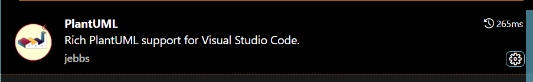
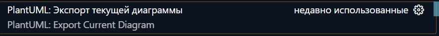

# Инструкция по работе с PlantUML

Как пользоваться?  

Можно использовать онлайн версии данного ПО, представленные на разных площадках (не рекомендую):  

https://www.planttext.com/  
 
https://plantuml-editor.kkeisuke.dev/  

http://www.plantuml.com/plantuml/uml/SyfFKj2rKt3CoKnELR1Io4ZDoSa70000  

Установить на Visaul studio code

## Установка в Visual studio code  

Установить расширение PlantUML для VS Code.  

  
Чтобы PlantUML корректно работал, дополнительно нужно установить:
* Java  
* Graphviz  

## Создание картинки
Для предпросмотра получаемой диграммы нажимем:  
```alt + D```
После нажимаем кнопку копировать и вставляем картинку куда надо  
Второй вариант  
Открываем палитру команд с помощью ```ctrl+shift+P``` далее пишем PlantUML и выбираем  
  
Выбираем формат и диаграмма автоматически сохранится в папку out текущей директории

## Основы работы с PlantUML

### Начало диаграммы:
    plantuml nameDiagramm
    @startuml
        Код диаграммы здесь
    @enduml

### Простой класс:

    plantuml
    @startuml
        class Person {
        - name: String
        - age: int
        + getName(): String
        + setAge(age: int): void
        }
    @enduml

#### Модификаторы доступа
    + -- public
    - -- private
    # -- protected
    ~ -- package private (Для java)

### Отношения между классами
    Типы отношений:


[На главную](../README.md)